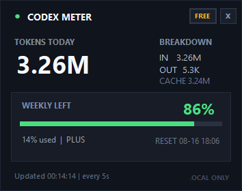

# Codex Usage Widget

一个轻量、无边框的 Windows 桌面小组件，用于实时查看本机 Codex。窗口会随尺寸自动切换形态：最小尺寸是只显示周额度百分比的圆形额度球，放大后则显示完整面板。

- 今日 Token 总量
- Input / Output / Cached Token 明细
- 周额度剩余与已用比例
- 周额度重置时间



## Download for Windows

**[Download Codex Usage Widget v0.3.0](https://github.com/yizhengarcanelec/codex-usage-widget/raw/main/download/Codex-Usage-Widget-v0.3.0-win-portable.zip)**

下载 ZIP 后解压，双击 `GPTUsageWidget.exe` 即可。无需安装，也不需要 API Key。

SHA-256：`497AA591EE0330FF299CFAD85A35AABDEBFE0BA9DA5166EF43A3B79F0001256F`

## 使用

从 GitHub Actions 的构建产物或 Releases 下载便携包，解压后双击 `GPTUsageWidget.exe`。

- 每 5 秒自动刷新。
- 拖动窗口空白区域可移动。
- 拖动任意边缘或四个角可缩放；最小为 144×144 的圆形额度球，完整面板最大为 480×360。
- 尺寸低于完整面板阈值时只显示周额度百分比；双击窗口可在圆球与标准面板之间快速切换。
- 右键窗口可立即刷新、切换置顶、切换尺寸或退出。
- 点击 `PIN` 切换置顶，点击 `X` 关闭。
- 重复启动不会产生多个窗口。

也可以使用 `GPTUsageWidget.exe --compact` 直接以圆形额度球启动。

## 数据与隐私

程序只读取当前用户目录下的 Codex 本地会话记录：

- `%USERPROFILE%\.codex\sessions`
- `%USERPROFILE%\.codex\archived_sessions`

程序不需要 API Key，不联网，也不会上传会话内容。今日 Token 按本地日历日汇总；如果本机缺少当天较早的记录，状态栏会显示 `partial history`。

周额度来自 Codex 写入本地会话事件的限额百分比，不是可换算成 Token 的余额。

## 兼容性

- Windows 10 / Windows 11
- x64 或 x86（AnyCPU）
- 使用系统自带的 .NET Framework 运行，无需安装额外依赖

## 本地构建

在 Windows PowerShell 中运行：

```powershell
.\build.ps1
```

生成文件位于 `release\GPTUsageWidget.exe`。

## GitHub Actions

仓库内置 Windows 构建工作流。Push、Pull Request 或手动运行 workflow 后，会生成可下载的 `GPT-Usage-Widget-win-portable` 构建产物。

## 技术说明

- C# / Windows Forms
- 单文件 WinExe
- 无第三方运行时依赖
- 本地只读扫描，活动会话文件使用共享读取
- 缩放时强制完整重绘并裁切窗口区域，避免无边框窗口残影
